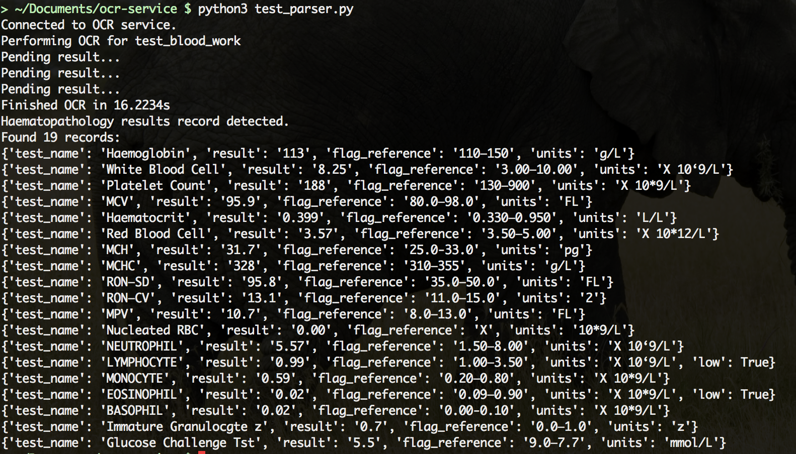

# ocr-service
Python wrapper for Google's tesseract ocr engine

# Setup
1. Install Python 3
2. run `pip3 install celery flask gunicorn redis Image pytesseract pdf2image`
3. run `python3 test_parser.py`

`test_parser.py` is a script that implements the ocr service with an example PDF file of blood test results, and parses out som e of the data into json records. These records can in turn be inserted into a database.

Example input:

Output:

